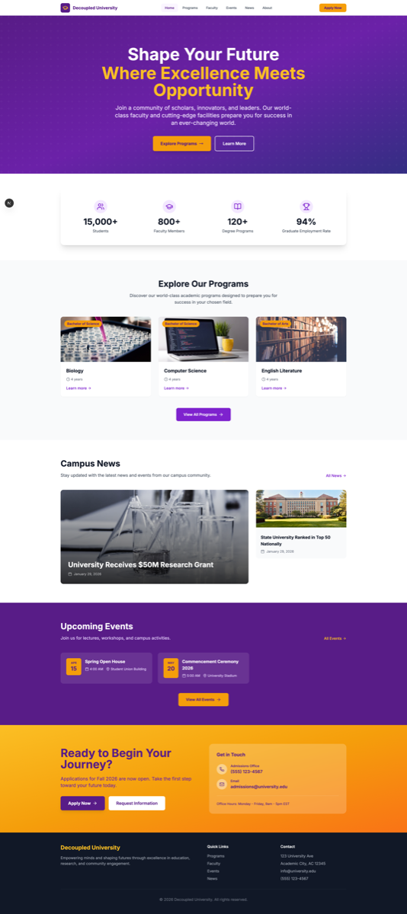

# Decoupled Photography

A photography studio website starter template for Decoupled Drupal + Next.js. Built for photography studios, freelance photographers, portrait studios, and creative agencies.



## Features

- **Galleries** - Showcase photo collections from weddings, portraits, commercial shoots, and events with image counts and shoot details
- **Services** - Present photography packages with pricing, session duration, and service categories
- **Testimonials** - Display client reviews with ratings, names, and service types
- **Static Pages** - About, pricing, and other informational pages
- **Modern Design** - Clean, accessible UI optimized for visual portfolio content

## Quick Start

### 1. Clone the template

```bash
npx degit nextagencyio/decoupled-photography my-photography
cd my-photography
npm install
```

### 2. Run interactive setup

```bash
npm run setup
```

This interactive script will:
- Authenticate with Decoupled.io (opens browser)
- Create a new Drupal space
- Wait for provisioning (~90 seconds)
- Configure your `.env.local` file
- Import sample content

### 3. Start development

```bash
npm run dev
```

Visit [http://localhost:3000](http://localhost:3000)

---

## Manual Setup

If you prefer to run each step manually:

<details>
<summary>Click to expand manual setup steps</summary>

### Authenticate with Decoupled.io

```bash
npx decoupled-cli@latest auth login
```

### Create a Drupal space

```bash
npx decoupled-cli@latest spaces create "My Photography Studio"
```

Note the space ID returned. Wait ~90 seconds for provisioning.

### Configure environment

```bash
npx decoupled-cli@latest spaces env 1234 --write .env.local
```

### Import content

```bash
npm run setup-content
```

This imports:
- Homepage with hero, stats (2,500+ sessions, 1,200+ clients, 35 awards, 15+ years), and booking CTA
- 4 galleries: Vineyard Wedding, Urban Portrait Series, Artisan Product Launch, Seaside Family Session
- 4 services: Wedding Photography ($3,500), Portrait Photography ($350), Commercial Photography ($1,200), Event Photography ($800)
- 4 testimonials from wedding, commercial, portrait, and event clients
- 2 static pages: About Lumiere Photography, Pricing

</details>

## Content Types

### Gallery
- **photography_style**: Style taxonomy (Wedding, Portrait, Commercial, Event)
- **shoot_date**: Date of the photo shoot
- **location**: Where the shoot took place
- **image**: Featured gallery image
- **image_count**: Number of images in the gallery

### Service
- **service_type**: Service category taxonomy (Wedding, Portrait, Commercial, Event)
- **starting_price**: Starting price for the service (e.g., "$3,500")
- **duration**: Session duration (e.g., "Full Day (8-10 hours)")
- **image**: Featured service image

### Testimonial
- **client_name**: Name of the client
- **service_type_name**: Type of service received
- **photo**: Client photo
- **rating**: Star rating (1-5)

### Homepage
- **hero_title**: Main headline (e.g., "Capturing Life's Finest Moments")
- **hero_subtitle**: Tagline (e.g., "Through the Art of Light")
- **hero_description**: Introductory paragraph
- **stats_items**: Key statistics (sessions completed, happy clients, awards, years)
- **featured_galleries_title**: Section heading for featured galleries
- **cta_title / cta_description**: Booking call-to-action block

### Basic Page
- General-purpose static content pages (About, Pricing, etc.)

## Customization

### Colors & Branding
Edit `tailwind.config.js` to customize colors, fonts, and spacing.

### Content Structure
Modify `data/photography-content.json` to add or change content types and sample content.

### Components
React components are in `app/components/`. Update them to match your design needs.

## Demo Mode

Demo mode allows you to showcase the application without connecting to a Drupal backend.

### Enable Demo Mode

```bash
NEXT_PUBLIC_DEMO_MODE=true
```

### Removing Demo Mode

1. Delete `lib/demo-mode.ts`
2. Delete `data/mock/` directory
3. Delete `app/components/DemoModeBanner.tsx`
4. Remove `DemoModeBanner` from `app/layout.tsx`
5. Remove demo mode checks from `app/api/graphql/route.ts`

## Deployment

### Vercel (Recommended)
[](https://vercel.com/new/clone?repository-url=https://github.com/nextagencyio/decoupled-photography)

### Other Platforms
Works with any Node.js hosting platform that supports Next.js.

## Documentation

- [Decoupled.io Docs](https://www.decoupled.io/docs)
- [Next.js Documentation](https://nextjs.org/docs)
- [Drupal GraphQL](https://www.decoupled.io/docs/graphql)

## License

MIT
